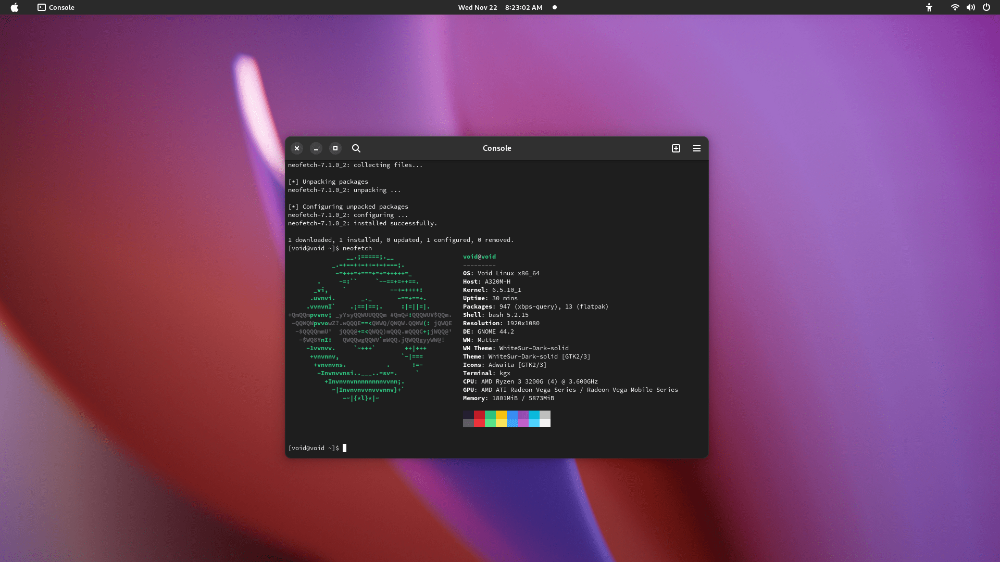
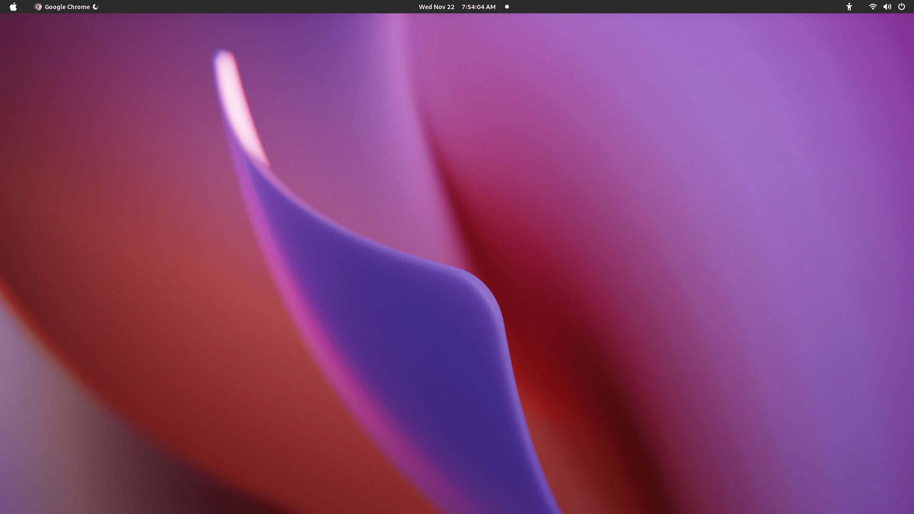
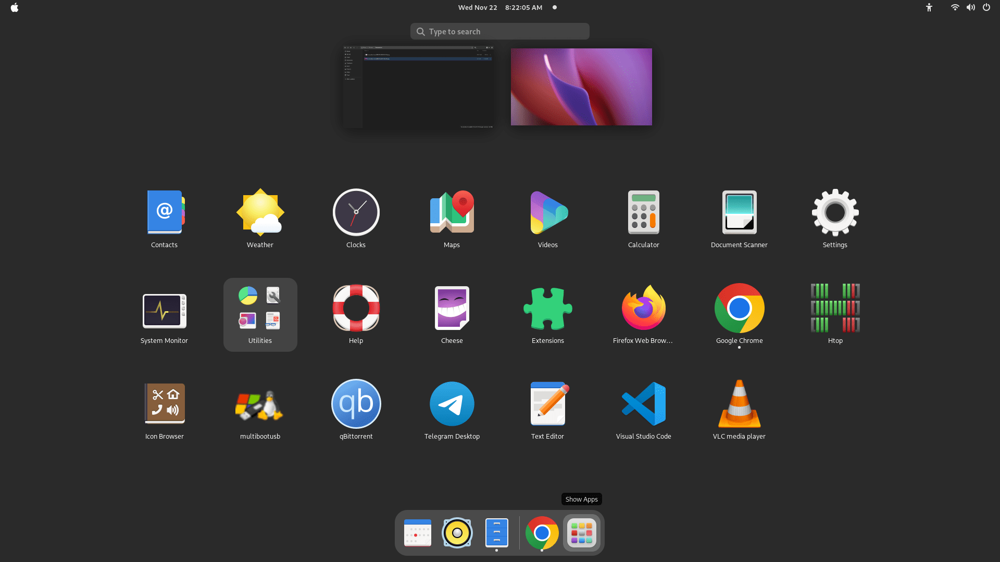

# VGI
VGI Stands For Void-Gnome-Installer is a Simple Script to install Gnome Desktop Environment in the Linux Distribution "VOID LINUX"

  
  

## INSTALLATION & USAGE
- Check speed of your void mirror using xmirror and set it to high speed:
`sudo xmirror`
- Install git and clone this repository:
`sudo xbps-install git`
`git clone https://github.com/shahmohsiin/VGI`
- run script.sh and let it complete:
`sudo yes 'yes' | bash script.sh`

- Thats it.
